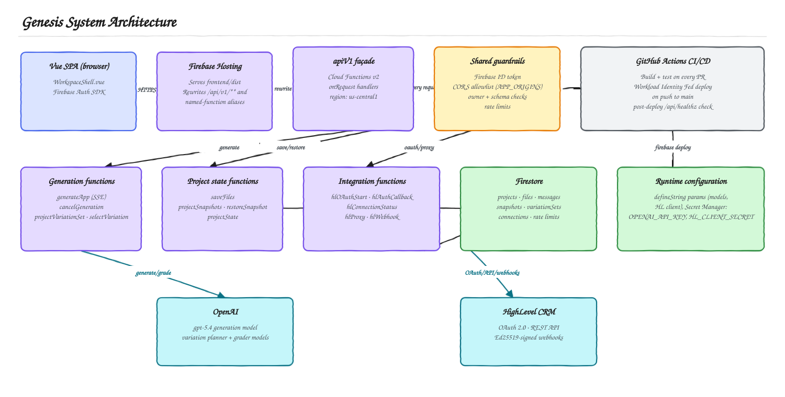
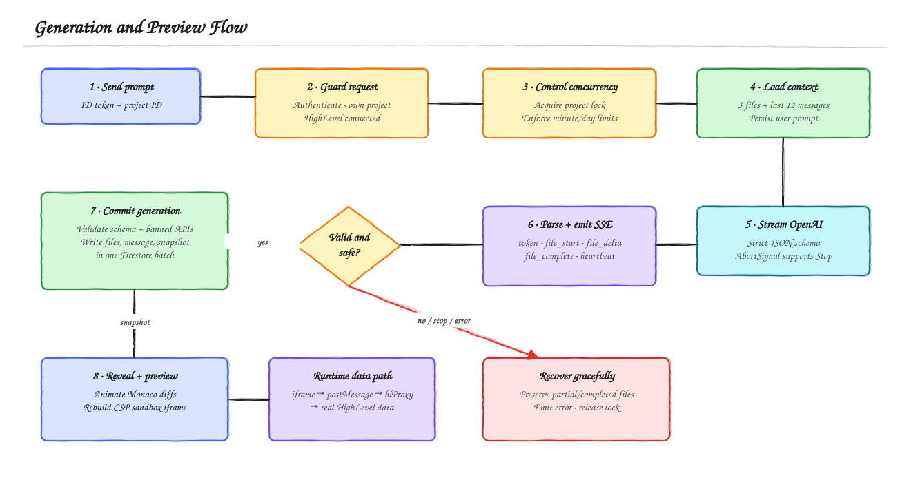

# Genesis Assignment Guide

This document maps the HighLevel Senior Engineer take-home requirements to the implemented system. The root [README](../README.md) remains the submission entry point; this guide is the technical appendix for reviewers.

For a visual, beginner-friendly explanation of the server-side flows, see the [Backend High-Level Design](BACKEND_HLD.md).

## System architecture



Editable source: [system-architecture.excalidraw](diagrams/system-architecture.excalidraw)

Genesis separates untrusted generated code from credentials and external APIs. The Vue SPA handles interaction and presentation. Firebase Auth establishes identity. Cloud Functions own OpenAI orchestration, persistence, OAuth, token refresh, and the allowlisted HighLevel proxy. Generated applications execute inside a CSP-restricted `srcdoc` iframe and can reach HighLevel only through a source-checked `postMessage` bridge.

## Requirement traceability

| Assignment requirement | Implementation | Verification |
|---|---|---|
| Email/password authentication and persistent sessions | `frontend/src/stores/auth.ts`, `frontend/src/views/AuthView.vue` | Sign in, refresh, and confirm the session remains active. |
| HighLevel OAuth 2.0, callback, secure token storage, refresh | `POST /api/v1/integrations/highlevel/authorizations` and `hlAuthCallback` in `functions/src/index.ts`; `functions/src/highlevel/tokens.ts` | Connect a sandbox location, return to the dashboard, and inspect the connected location label. |
| Owner-scoped project CRUD and soft delete | `frontend/src/stores/projects.ts`, `firestore.rules` | Create, rename, and delete a project; a different Firebase user cannot read it. |
| Server-side AI orchestration with bounded context | `functions/src/generate/openai.ts`, `functions/src/generate/persistence.ts` | Generate twice and confirm the second request receives current files and recent messages. |
| Real-time SSE with file boundaries and errors | `functions/src/index.ts`, `functions/src/shared/protocol.ts`, `frontend/src/services/generation.ts` | Watch summary and file deltas arrive live in Monaco. |
| File tree, reading, and manual saves | `frontend/src/components/workspace/WorkspaceShell.vue`, `PUT /api/v1/projects/{projectId}/files` | Switch among the three files, edit one, save, and reload. |
| Snapshot creation, listing, and restore | `functions/src/generate/persistence.ts`, snapshot sheet in `WorkspaceShell.vue` | Generate or save manually, open History, and restore a previous state. |
| shadcn-vue-based Vue 3 SPA | `frontend/components.json`, `frontend/src/components/ui/` | Inspect the generated component registry and the auth/dashboard/workspace UI. |
| Monaco live editor, tabs, and streaming read-only state | `WorkspaceShell.vue` | During generation, type into the editor and confirm edits are blocked. |
| Live iframe preview backed by real HighLevel data | `frontend/src/lib/srcdoc.ts`, `POST /api/v1/integrations/highlevel/proxy-requests`, `functions/src/highlevel/proxy.ts` | Generate a contacts or appointments view and confirm sandbox records appear. |
| Graceful malformed response, stream interruption, and API errors | structured stream parser, validation layer, partial persistence, workspace error UI | Stop a generation or force an invalid API call; completed work remains and a clear error appears. |
| Firebase Hosting and Functions deployment | `firebase.json`, `.firebaserc`, `.github/workflows/firebase-deploy.yml` | Open the live URL and the `/api/v1/health` endpoint. |
| Secrets and environment templates | `.env.example`, `frontend/.env.example`, `functions/.env.example`, Firebase Secret Manager bindings | Confirm secrets are absent from source and Functions can read configured secrets. |
| Versioned REST API and OpenAPI 3.1 contract | `functions/src/http/api-v1.ts`, `docs/openapi.yaml`, `docs/API.md` | Import the contract into Swagger Editor and call `/api/v1/health`. |
| Automated browser UI coverage | `frontend/e2e/public.spec.ts`, `frontend/playwright.config.ts` | Run `pnpm run test:ui` for desktop and mobile Chromium checks. |
| Marketplace submission package | `docs/MARKETPLACE_LISTING.md`, `frontend/public/brand/`, `upload-ready-screenshots/` | Review the final copy, icon, screenshot inventory, and pre-submission gaps. |
| Security review and residual-risk register | `docs/SECURITY.md` | Verify controls in source and work through the production checklist. |

## Generation and preview flow



Editable source: [generation-flow.excalidraw](diagrams/generation-flow.excalidraw)

The server is authoritative for project identity, stored files, conversation context, and connected HighLevel location. It does not trust source files sent by the browser. A Firestore generation lock prevents two tabs from racing on the same project, while fixed-window counters cap generation and proxy traffic.

The OpenAI response follows a strict structured-output schema containing exactly `index.html`, `styles.css`, and `app.js`. A streaming parser converts model deltas into the UI protocol. Before persistence, a second validator rejects banned browser APIs, non-bridge parent-window access, and secret-shaped values. Successful output is stored with its assistant message and snapshot; interrupted output preserves completed or partial work.

## SSE event protocol

| Event | Purpose |
|---|---|
| `generation_started` | Identifies the generation and model. |
| `token` | Streams the assistant summary. |
| `file_start` | Announces the file path and editor language. |
| `file_delta` | Appends source text for the active file. |
| `file_complete` | Supplies final size and SHA-256 digest. |
| `snapshot_created` | Identifies the persisted point-in-time snapshot. |
| `complete` | Closes a successful generation. |
| `error` | Returns a code, user-facing message, and recovery status. |

Comment-only heartbeats keep long-lived HTTP connections active without becoming application events.

## Persistence model

| Firestore path | Responsibility | Client access |
|---|---|---|
| `projects/{projectId}` | Name, description, owner, selected HighLevel location, generation lock | Owner can create/read and update a small allowlist of fields. |
| `projects/{projectId}/files/{path}` | Current HTML, CSS, and JavaScript | Owner read-only; Functions write. |
| `projects/{projectId}/messages/{messageId}` | User/assistant generation history | Owner read-only; Functions write. |
| `projects/{projectId}/snapshots/{snapshotId}` | Immutable point-in-time file sets and metadata | Owner read-only; Functions write/restore. |
| `highlevelConnections/{uid}` | Access/refresh tokens and refresh lease | Server only. |
| `oauthStates/{state}` | Short-lived OAuth state binding | Server only. |
| `rateLimits/{window}` | Shared fixed-window counters | Server only. |
| `webhookDedupe/{eventId}` | Replay protection | Server only. |
| `users/{uid}/hlEvents/{eventId}` | Verified HighLevel events for the workspace | Owner read-only; Functions write. |

## HighLevel boundary

Generated code cannot make arbitrary network requests. The bridge exposes only:

- `contacts.list`, `contacts.create`, `contacts.update`
- `conversations.list`, `conversations.messages`, `conversations.send`
- `calendars.list`, `calendars.availability`
- `appointments.list`

The browser checks the iframe message source and operation name. `POST /api/v1/integrations/highlevel/proxy-requests` authenticates the Firebase user, validates operation-specific parameters, applies a per-user rate limit, resolves an unexpired server-side token, and adds the connected `locationId`. OAuth secrets and HighLevel tokens never enter the generated application.

## Local verification

```bash
pnpm run install:all
pnpm run test
pnpm run build
pnpm run dev:emulators
pnpm run dev:frontend
```

Use `http://127.0.0.1:5173` consistently during OAuth testing and set `VITE_FUNCTIONS_BASE_URL` to the local Functions emulator URL. Real generation still requires configured OpenAI credentials and a real HighLevel sandbox connection; there is deliberately no demo-data fallback.

## Submission checklist

- Public GitHub repository is reachable.
- Firebase Hosting and `/api/v1/health` URLs are reachable.
- Email/password is enabled in Firebase Authentication.
- Firestore rules and indexes are deployed.
- `OPENAI_API_KEY` and `HL_CLIENT_SECRET` are bound in Secret Manager.
- HighLevel marketplace scopes and OAuth redirect URI match the README.
- A sandbox location with contacts and at least one calendar is connected.
- The five-minute walkthrough is recorded using [LOOM_WALKTHROUGH.md](LOOM_WALKTHROUGH.md).
- The final Loom URL replaces the placeholder in the root README and appears in the submission email.
- The screenshot set in [MARKETPLACE_LISTING.md](MARKETPLACE_LISTING.md) contains only synthetic sandbox data and approved account identifiers.

## Diagram maintenance

Open any `.excalidraw` file at [excalidraw.com](https://excalidraw.com) to edit it. After changes, export an SVG with the same base filename so Markdown continues to render the latest version. The sources use a white-canvas, hand-drawn Excalidraw treatment and one shared semantic palette: blue for user/UI, violet for internal services, green for data and completed state, cyan for external systems, amber for decisions and trust controls, red for failures, and gray for neutral infrastructure.

To reproduce the backend HLD sources and SVGs from the diagram definition, run `pnpm run docs:diagrams`.
