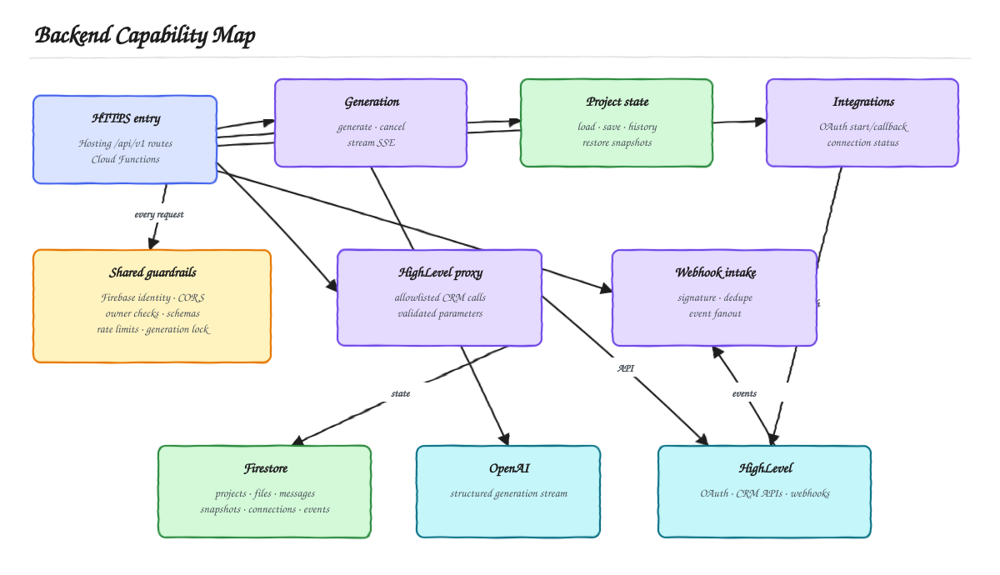
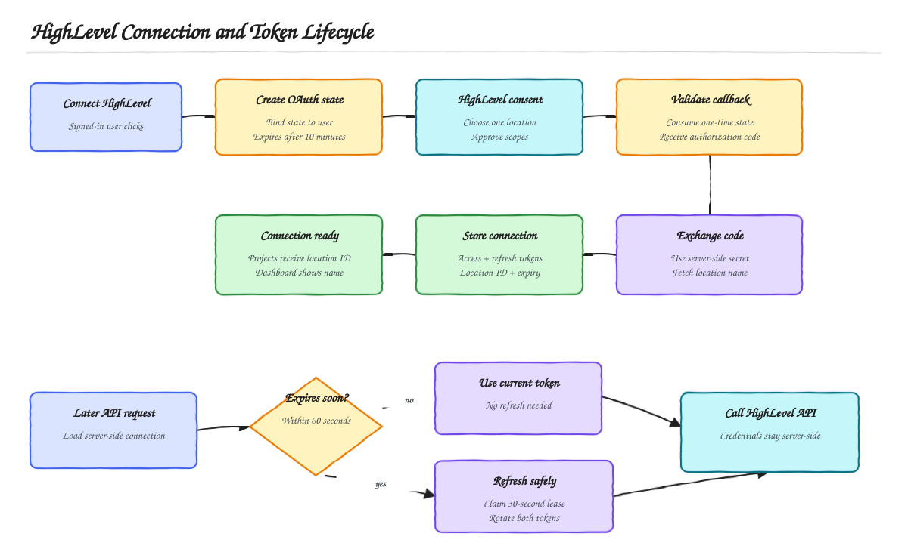
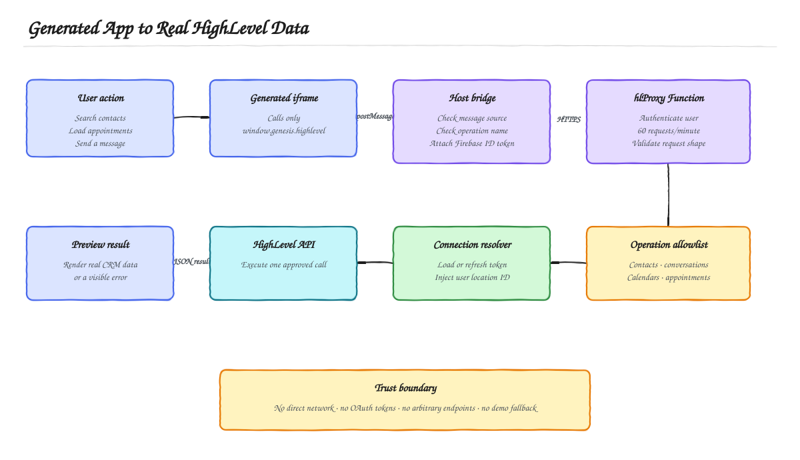
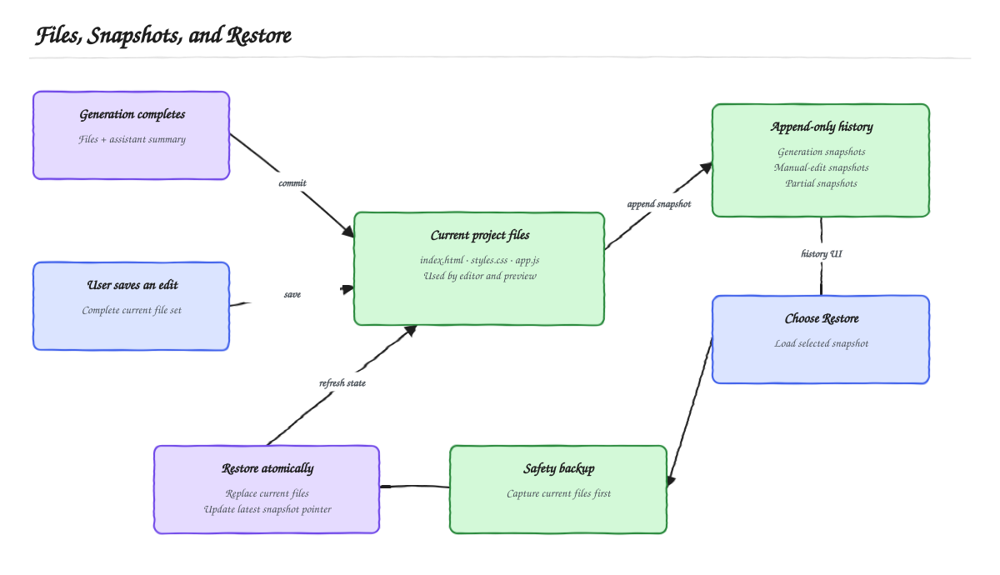
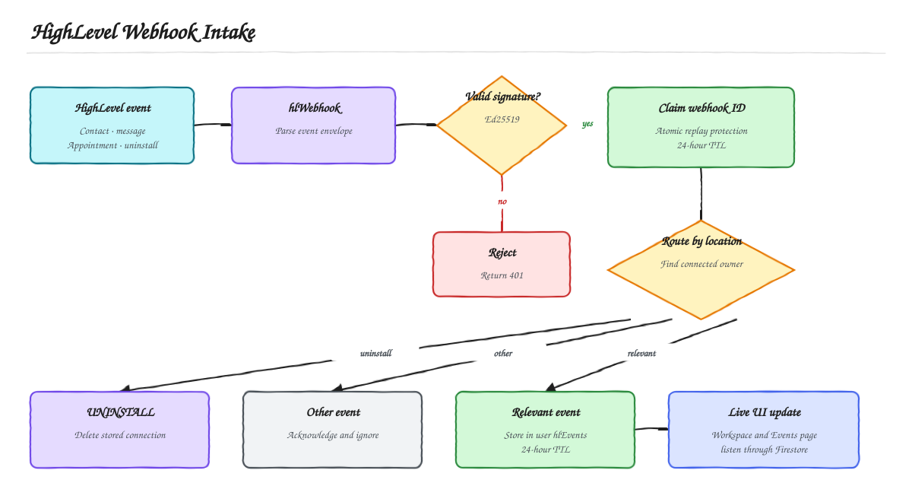
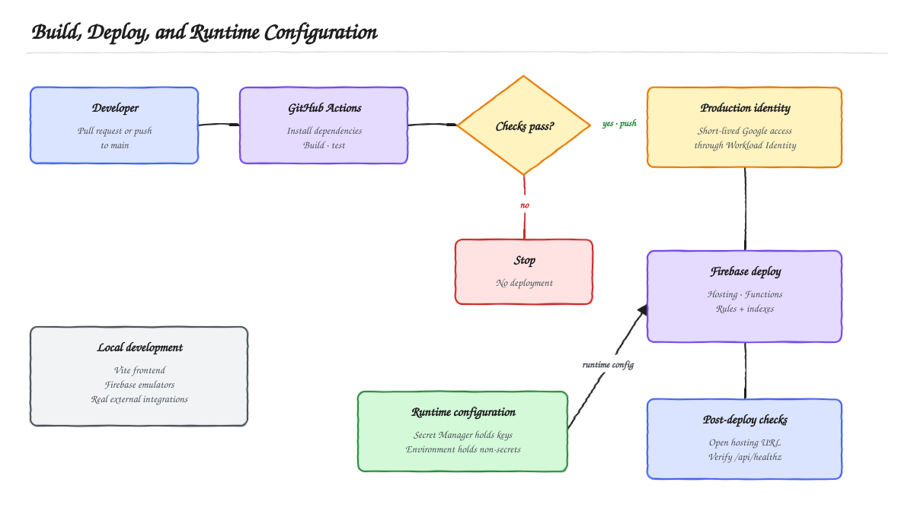

# Genesis Backend — High-Level Design

This is the beginner-friendly map of what happens behind the Genesis interface. Start with the capability map, then follow only the flow related to the feature you are trying to understand. The existing [system architecture and generation flow](ASSIGNMENT_GUIDE.md) cover the overall product and AI generation path, so those concepts are not repeated here.

## 1. What the backend is responsible for

[Open the editable Excalidraw source](diagrams/backend-capability-map.excalidraw)

Cloud Functions form the trusted backend boundary. The browser can manage its own project metadata through owner-scoped Firestore rules, but files, snapshots, OAuth credentials, AI generation, and HighLevel requests are controlled by server code. Browser-facing operations enter through the resource-oriented `/api/v1` facade; the OAuth callback and webhook remain separate inbound integration endpoints.

## 2. Connecting a HighLevel account

[Open the editable Excalidraw source](diagrams/oauth-token-lifecycle.excalidraw)

The OAuth state is a short-lived, one-time link between the callback and the signed-in Firebase user. Tokens are stored in a server-only collection. When an access token is about to expire, a short Firestore lease ensures only one request refreshes and rotates the token pair.

## 3. How a generated app reaches real CRM data

[Open the editable Excalidraw source](diagrams/highlevel-proxy-flow.excalidraw)

Generated code never receives credentials and cannot choose arbitrary URLs. It asks the host page for a named operation; the host calls `POST /api/v1/integrations/highlevel/proxy-requests`, and the server authenticates the user, validates parameters, resolves the connected location, and performs one allowlisted HighLevel request. Failures remain visible instead of being replaced with sample data.

## 4. How file history and restore work

[Open the editable Excalidraw source](diagrams/snapshot-restore-flow.excalidraw)

There is one current three-file state for fast loading and an append-only snapshot history for recovery. Generations, manual edits, and interrupted generations can create history entries. A restore first preserves the current state as a backup, then replaces the current files with the selected snapshot.

## 4b. How multiple UI variations work

A small structured planning call runs in front of every generation and classifies the request as a single generation or a variation request. Anything that fails, times out, returns invalid structured output, or classifies a variation request below 0.8 confidence falls back to the single path, so planning can never block ordinary generation.

A variation request generates exactly four candidates from one shared feature contract and four differentiated briefs, at a concurrency of two with all-settled semantics: one failed candidate never cancels a viable sibling. All four candidates use the same user-selected model and reasoning effort, so the comparison measures the generated applications rather than unequal model budgets.

Every completed candidate is qualified deterministically: schema, security, the mandatory Vue runtime, and JavaScript parseability are hard failures, while HighLevel contract use, required states, required features, accessibility, and responsive rules produce cited evidence and a bounded soft score out of 100. At least two candidates must qualify; otherwise the batch ends with `VARIATION_INSUFFICIENT_CANDIDATES` and the active project is left untouched.

Grading is blinded. Candidates are shuffled and given random opaque aliases before anything reaches the grader, and candidate source is delimited as untrusted data rather than instructions. Variation briefs, generation order, model identity, internal rank, and display position never enter a grading prompt. The grader scores each candidate independently against a 100-point rubric, then judges the top three pairwise in one call. The final rank is 70 percent rubric and 30 percent pairwise, with ties resolved by feature fidelity, then functional correctness, then the opaque alias. A transport or parse failure is retried once; a second failure falls back to deterministic ranking and marks the set `deterministic_fallback`.

Only the top two candidates are persisted, as one variation-set document plus exactly two candidate documents, with the project pointed at the pending set in the same commit. Discarded candidate code, briefs, grades, and identifiers are never written. The user chooses a finalist, and only that selection — transactionally, and only while the base snapshot is still current — replaces the active files and creates a normal snapshot. The unselected finalist stays reloadable, and the promoted snapshot links back to its variation set so the comparison can be reopened from history.

A variation batch charges four generation quota units against the same atomic counters a single request charges one unit against, holds the existing project generation lock for the whole batch, and runs under a 540-second function timeout with the existing 512 MiB allocation.

## 5. How HighLevel events enter Genesis

[Open the editable Excalidraw source](diagrams/webhook-event-flow.excalidraw)

Every webhook must pass Ed25519 signature verification and atomic replay protection. The location ID maps the event to a Firebase user. Relevant contact, message, and appointment events are written to that user's event feed; an uninstall event removes the stored connection.

## 6. How changes reach production

[Open the editable Excalidraw source](diagrams/deployment-runtime-flow.excalidraw)

Pull requests run the same build and test gate without deploying. A successful push to `main`, or a manual workflow run, authenticates to Google Cloud through Workload Identity Federation and deploys Firebase Hosting, Functions, rules, and indexes. Secrets remain in Secret Manager and are not copied into GitHub.

## Suggested reading order

1. [System architecture](diagrams/system-architecture.svg)
2. [Backend capability map](diagrams/backend-capability-map.svg)
3. [Generation flow](diagrams/generation-flow.svg)
4. OAuth, proxy, snapshot, webhook, or deployment flow as needed

The diagrams intentionally omit individual classes, helper functions, payload fields, and UI implementation details. They describe ownership, trust boundaries, state transitions, and service interactions rather than mirroring the codebase.
