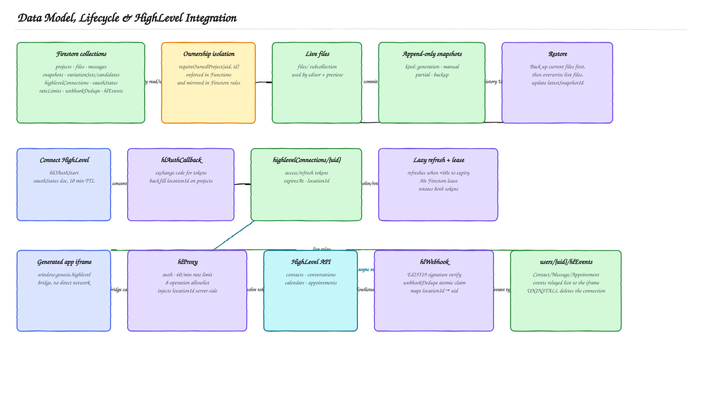

# Genesis Backend — High-Level Design

This is the beginner-friendly map of what happens behind the Genesis interface. Start with the system architecture, then follow only the flow related to the feature you are trying to understand. The root [README](../README.md) covers requirement-by-requirement traceability, so it is not repeated here.

## 1. What the backend is responsible for

[Open the editable Excalidraw source](diagrams/system-architecture.excalidraw)

Cloud Functions form the trusted backend boundary. The browser can manage its own project metadata through owner-scoped Firestore rules, but files, snapshots, OAuth credentials, AI generation, and HighLevel requests are controlled by server code. Browser-facing operations enter through the resource-oriented `/api/v1` facade; the OAuth callback and webhook remain separate inbound integration endpoints. Deployment runs through GitHub Actions on every push to `main`, and non-secret configuration and Secret Manager bindings are described in the same diagram.

## 2. How a generation request becomes one or more apps

[Open the editable Excalidraw source](diagrams/generation-and-grading-pipeline.excalidraw)

A small structured planning call runs in front of every generation and classifies the request as a single generation or a variation request. Anything that fails, times out, returns invalid structured output, or classifies a variation request below 0.8 confidence falls back to the single path, so planning can never block ordinary generation.

A variation request generates exactly four candidates from one shared feature contract and four differentiated briefs, running fully in parallel (concurrency equal to the candidate count) with all-settled semantics: one failed candidate never cancels a viable sibling. All four candidates use the same user-selected model and reasoning effort, so the comparison measures the generated applications rather than unequal model budgets.

Every completed candidate is qualified deterministically: schema, security, the mandatory Vue runtime, and JavaScript parseability are hard failures, while HighLevel contract use, required states, required features, accessibility, and responsive rules produce cited evidence and a bounded soft score out of 100. At least two candidates must qualify; otherwise the batch ends and the active project is left untouched.

Grading is blinded. Candidates are shuffled and given random opaque aliases before anything reaches the grader, and candidate source is delimited as untrusted data rather than instructions. Variation briefs, generation order, model identity, internal rank, and display position never enter a grading prompt. The grader scores each candidate independently against a 100-point rubric; there is no pairwise comparison pass. Ties are resolved by feature fidelity, then functional correctness, then the opaque alias. A transport or parse failure is retried once; a second failure falls back to deterministic ranking and marks the set `deterministic_fallback`.

Only the top two candidates are persisted, as one variation-set document plus exactly two candidate documents, with the project pointed at the pending set in the same commit. Discarded candidate code, briefs, grades, and identifiers are never written. The user chooses a finalist, and only that selection — transactionally, and only while the base snapshot is still current — replaces the active files and creates a normal snapshot. The unselected finalist stays reloadable, and the promoted snapshot links back to its variation set so the comparison can be reopened from history.

A variation batch charges four generation quota units against the same atomic counters a single request charges one unit against, holds the existing project generation lock for the whole batch, and runs under a 540-second function timeout with the existing 512 MiB allocation. See the [Multi-App Preview: Backend Guide](MULTI_APP_PREVIEW_BACKEND.md) for the full detail behind this diagram.

## 3. Data model, file history, and the HighLevel integration

[Open the editable Excalidraw source](diagrams/data-lifecycle-and-highlevel-integration.excalidraw)

**Firestore and snapshots.** There is one current three-file state (`files/`) for fast loading and an append-only snapshot history for recovery. Generations, manual edits, and interrupted generations can create history entries. A restore first preserves the current state as a backup, then replaces the current files with the selected snapshot. Every read and write is scoped by `requireOwnedProject`, enforced in Functions and mirrored in Firestore rules.

| Firestore path | Responsibility | Client access |
|---|---|---|
| `projects/{projectId}` | Name, description, owner, selected HighLevel location, generation lock | Owner can create/read and update a small allowlist of fields. |
| `projects/{projectId}/files/{path}` | Current HTML, CSS, and JavaScript | Owner read-only; Functions write. |
| `projects/{projectId}/messages/{messageId}` | User/assistant generation history | Owner read-only; Functions write. |
| `projects/{projectId}/snapshots/{snapshotId}` | Immutable point-in-time file sets and metadata | Owner read-only; Functions write/restore. |
| `projects/{projectId}/variationSets/{variationSetId}` (+ `candidates`) | One batch's finalists — see the [Multi-App Preview: Backend Guide](MULTI_APP_PREVIEW_BACKEND.md) | Owner read-only; Functions write. |
| `highlevelConnections/{uid}` | Access/refresh tokens and refresh lease | Server only. |
| `oauthStates/{state}` | Short-lived OAuth state binding | Server only. |
| `rateLimits/{window}` | Shared fixed-window counters | Server only. |
| `webhookDedupe/{eventId}` | Replay protection | Server only. |
| `users/{uid}/hlEvents/{eventId}` | Verified HighLevel events for the workspace | Owner read-only; Functions write. |

**Connecting a HighLevel account.** The OAuth state is a short-lived, one-time link between the callback and the signed-in Firebase user. Tokens are stored in a server-only collection (`highlevelConnections/{uid}`). When an access token is about to expire, a short Firestore lease ensures only one request refreshes and rotates the token pair.

**How a generated app reaches real CRM data.** Generated code never receives credentials and cannot choose arbitrary URLs. It asks the host page for a named operation; the host calls `POST /api/v1/integrations/highlevel/proxy-requests`, and the server authenticates the user, validates parameters against an 8-operation allowlist, resolves the connected location, and performs one allowlisted HighLevel request. Failures remain visible instead of being replaced with sample data.

**How HighLevel events enter Genesis.** Every webhook must pass Ed25519 signature verification and atomic replay protection (`webhookDedupe`). The location ID maps the event to a Firebase user. Relevant contact, message, and appointment events are written to that user's event feed and relayed live to any open generated-app iframe; an `UNINSTALL` event removes the stored connection.

## Suggested reading order

1. [System architecture](diagrams/system-architecture.svg) — the shape of the whole system and how it deploys.
2. [Generation and multi-variation grading pipeline](diagrams/generation-and-grading-pipeline.svg) — how a prompt becomes one or four candidate apps and how a finalist gets promoted.
3. [Data model, lifecycle, and HighLevel integration](diagrams/data-lifecycle-and-highlevel-integration.svg) — how state is stored, restored, and how the HighLevel connection, proxy, and webhooks work.

The diagrams intentionally omit individual classes, helper functions, payload fields, and UI implementation details. They describe ownership, trust boundaries, state transitions, and service interactions rather than mirroring the codebase.

## Diagram maintenance

Open any `.excalidraw` file at [excalidraw.com](https://excalidraw.com) to edit it by hand. All three are also generated from a single source of truth in [`scripts/generate-doc-diagrams.mjs`](../scripts/generate-doc-diagrams.mjs) — prefer editing that file and running `pnpm run docs:diagrams` so the `.excalidraw` and `.svg` pair stay in sync and diagrams stay consolidated as the system evolves. The sources use a white-canvas, hand-drawn Excalidraw treatment and one shared semantic palette: blue for user/UI, violet for internal services, green for data and completed state, cyan for external systems, amber for decisions and trust controls, red for failures, and gray for neutral infrastructure.
