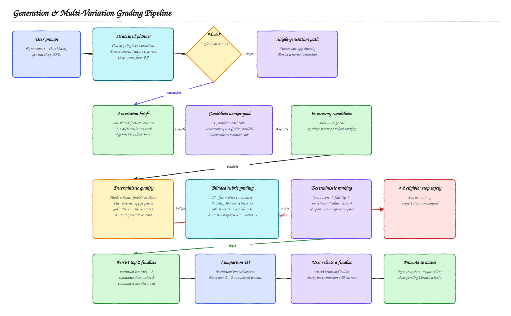

# Multi-App Preview: Backend Guide

This guide explains the multiple-preview feature for a technical leader who does not need to know the frontend implementation. The editable Excalidraw sources live beside the rendered SVGs in [`docs/diagrams`](diagrams/).

## Executive summary

A generation request now starts with a small structured planning call. Ordinary requests continue through the existing single-app stream. Requests for alternatives become a controlled batch: one shared feature contract, four presentation briefs, four isolated application generations, deterministic qualification, blinded grading, and two persisted finalists.

The important architectural choice is separation of concerns:

- The application `systemPrompt` remains the common policy and runtime contract for every candidate.
- The planner prompt decides whether alternatives were requested and produces the feature contract and briefs.
- A developer-controlled directive adds exactly one brief to each candidate request. It may vary presentation and interaction, but not required behavior.
- The grader has its own prompt and never receives candidate briefs, generation order, model identity, internal rank, or display position.

[Open the editable Excalidraw source](diagrams/generation-and-grading-pipeline.excalidraw)

## How the multi-prompt system works

The planner sees the raw prompt, bounded project metadata, the last 12 messages, and current file names. It does not receive current file contents. Its strict structured output contains:

- `mode`: `single` or `variations`;
- a confidence score;
- one shared feature contract containing required features, optional features, and invariants;
- exactly four generation briefs when variation mode is selected.

Each brief describes design intent, information architecture, interaction model, visual direction, density, and differentiators. Every candidate receives the same raw request, current files, context, model configuration, base `systemPrompt`, and feature contract, but only its own brief. Candidates never see one another.

Planner failure, invalid structured output, or variation confidence below `0.8` falls back to the normal single-generation path. A real cancellation remains a cancellation and is not converted into a single generation.

## What changed around the system prompt

The feature did not create four independent system prompts. Instead, it added three purpose-specific prompt layers around the existing generator:

1. **Planner instructions** classify intent and create the shared contract plus four briefs.
2. **The existing application `systemPrompt`** continues to define the three-file Vue runtime, HighLevel API rules, security restrictions, state handling, accessibility, responsive behavior, and visual quality baseline.
3. **A per-candidate directive** is appended to model input after the raw request. It states that the feature contract is mandatory and that the brief may shape only information architecture, interaction, composition, density, and visual direction.

The grader is intentionally separate. It uses a grading prompt rather than the application `systemPrompt`, and treats generated source as untrusted material inside explicit boundaries.

This design preserves consistent runtime and product behavior while creating meaningful UI diversity.

## Qualification and grading

Qualification has two layers. Hard failures make a candidate ineligible:

- invalid three-file schema or file-size limits;
- forbidden APIs, unsafe browser behavior, or secret-shaped content;
- missing mandatory Vue runtime;
- JavaScript parse failure.

Soft checks produce deterministic evidence and a score out of 100:

| Check | Points |
| --- | ---: |
| Required feature evidence | 30 |
| Supported HighLevel bridge contracts | 25 |
| Loading, error, and empty states | 20 |
| Accessibility evidence | 15 |
| Responsive CSS evidence | 10 |

At least two candidates must qualify. Otherwise, no variation candidates are persisted and active project files remain unchanged.

Eligible candidates are shuffled and assigned random UUID aliases. The model grades each candidate independently using this rubric:

| Criterion | Maximum |
| --- | ---: |
| Prompt and feature fidelity | 30 |
| Functional correctness | 25 |
| Robustness and failure handling | 15 |
| Usability | 10 |
| Accessibility | 10 |
| Responsive behavior | 5 |
| Maintainability | 5 |

The implemented ranking algorithm sorts by total rubric score, then feature fidelity, then functional correctness, then opaque alias. The grading call is retried once. If both attempts fail, the system ranks by deterministic qualification score and marks the run as `deterministic_fallback`.

An earlier design specification proposed a 70/30 independent-plus-pairwise blend. The current implementation does **not** perform pairwise grading; it uses independent rubric scores and deterministic tie-breakers only, as shown in the pipeline diagram above.

## Lifecycle, persistence, and safety boundaries

Four candidates are generated in a worker pool with concurrency equal to the candidate count, i.e. fully in parallel. Candidate code stays in Firebase Function memory until validation and ranking complete. The client receives real phase milestones, not raw candidate code or estimated percentages.

Only the top two finalists are persisted. The other candidates are discarded and never reach the browser. Finalist metadata is emitted only after persistence succeeds, followed by chunked file events with SHA-256 integrity metadata. A disconnected client can reload the two finalists from the authenticated variation-set endpoint.

The active project is not modified while previews are being generated or compared. Selection validates that the variation set is ready, the chosen candidate is a finalist, and the project's latest snapshot still matches the batch's base snapshot. One transaction then creates a normal snapshot, promotes the selected files, clears the pending pointer, and records the assistant summary. The unselected finalist remains available for a later, recoverable switch. This snapshot/promotion mechanism is shared with the rest of the project's file history — see the [Data model, lifecycle, and HighLevel integration diagram](BACKEND_HLD.md#3-data-model-file-history-and-the-highlevel-integration) for how it fits alongside manual saves and restores.

## Operational characteristics

- Four generation units are charged for a variation batch; planner and grader calls are not separate user-visible units.
- The project generation lock is held for the entire batch.
- One abort signal covers planning, queued and active candidate work, grading, and finalist transfer.
- Candidate failures use all-settled behavior and do not cancel successful siblings.
- The generation function uses a 540-second ceiling and sends SSE heartbeats every 15 seconds.
- Stable `Direction A` / `Direction B` placement is derived from the variation-set ID and does not reveal internal rank.

